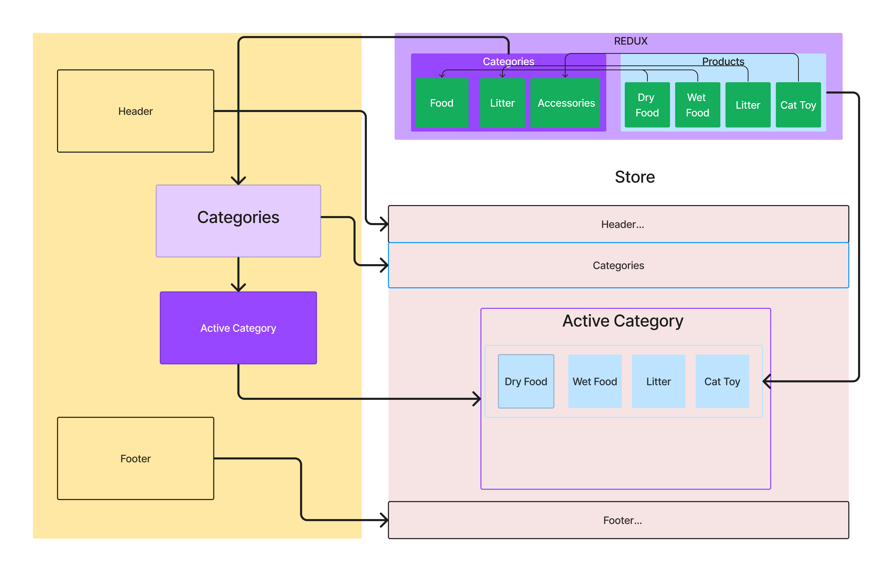

# Store Project

A simple online store project built with React and Redux. The store allows users to browse and filter products based on different categories. It utilizes Material-UI for the user interface components.

## Table of Contents

- [Overview](#overview)
- [Installation](#installation)
- [Usage](#usage)
- [UML Diagram](#uml-diagram)
- [Contributing](#contributing)
- [License](#license)

## Overview

The Store Project is a web application that provides a user-friendly interface for browsing and purchasing products. It includes the following features:

- Categories: Users can browse products by different categories, such as "Cat Food," "Litter," and "Accessories."
- Filtering: Users can filter products based on the selected category, allowing them to view specific product listings.
- Product Details: Users can view detailed information about each product, including the name, description, price, and inventory.
- Shopping Cart: Users can add products to their shopping cart and proceed to checkout.

The project utilizes React for the user interface components and Redux for managing the application state. Material-UI is used for styling and creating a consistent design across the application.

## Installation

To install and run the Store Project locally, follow these steps:

1. Clone the repository: `git clone https://github.com/your-username/store-project.git`
2. Navigate to the project directory: `cd store-project`
3. Install the dependencies: `npm install`
4. Start the development server: `npm start`
5. Open the application in your browser at `http://localhost:3000`

## Usage

Once the application is running, you can use the following steps to interact with the Store Project:

1. Browse Categories: Click on the category links in the navigation bar to browse products specific to each category.
2. Filter Products: After selecting a category, the product list will be filtered to show only the products from that category.
3. View Product Details: Click on a product card to view detailed information about the selected product, including its name, description, price, and inventory.
4. Add to Cart: On the product details page, click the "Add to Cart" button to add the product to your shopping cart.
5. Proceed to Checkout: Click on the "Cart" button in the navigation bar to view your shopping cart. From there, you can proceed to checkout and complete your purchase.

## UML Diagram

## Contributing

Contributions to the Store Project are welcome! If you find any bugs, have feature requests, or want to contribute improvements, please follow these steps:

1. Fork the repository.
2. Create a new branch for your feature or bug fix: `git checkout -b my-feature`
3. Make the necessary changes and commit your changes: `git commit -am 'Add new feature'`
4. Push the changes to your forked repository: `git push origin my-feature`
5. Submit a pull request describing your changes.

Please ensure that your contributions adhere to the project's coding style and conventions.

## License

The Store Project is released under the [MIT License](LICENSE).
